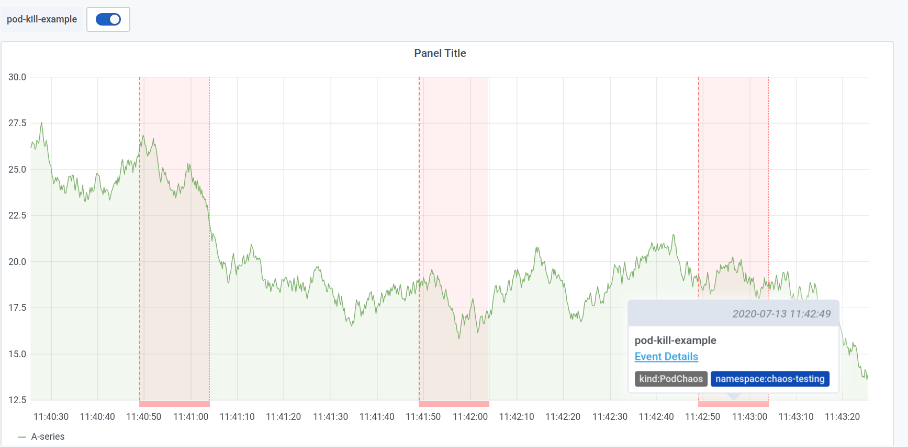
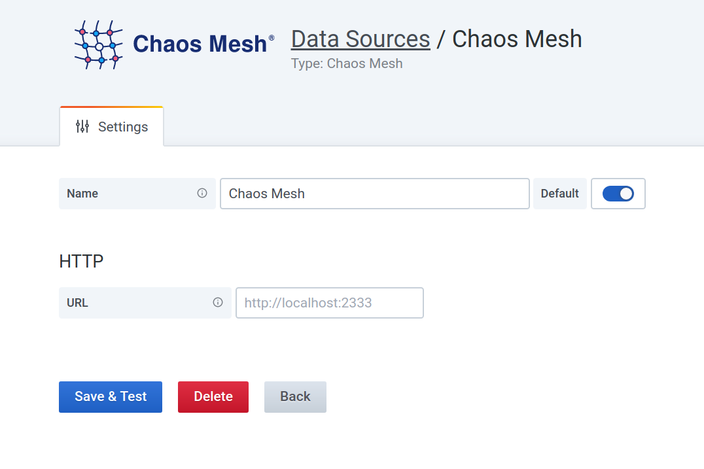
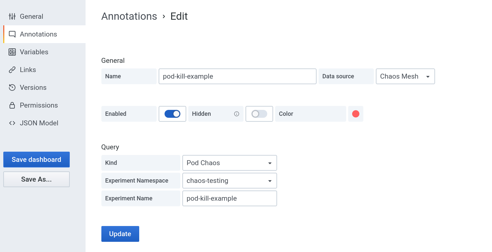

# Chaos Mesh Data Source

Visualize Chaos Mesh Events with Grafana.

## Usage

### Configure the data source

Go to Grafana -> Configuration -> Data Sources, click `Add data source` button.

Enter Chaos Mesh into the search bar and then you can see the data source.

Enter the URL of Chaos Dashboard, and click `Save & Test` to check availability.

It is best to make sure your network can access this URL as well.

### Chaos Events Query

Add a new query panel and choose Chaos Mesh Data source. Enter the required parameters below for what experiment you want to search.

Please note that Chaos Mesh Data source only supports `Table` type visualization.

### Chaos Events Annotations Query

#### Configure Annotation

Add a new annotation, choose type as `Chaos Mesh`. Enter the required parameters below for what experiment you want to search.

#### View the results

To view the annotations, you should have a panel. If the annotation is enabled and there are some Chaos events at the time range, you can see the annotations in your dashboard.

There is also a link `Event Details`, you can click this link and go to Chaos Dashboard UI to see the details of that event.

## Development

For detailed development, please check [Tutorial](https://github.com/chaos-mesh/chaos-mesh-datasource/blob/master/docs/dev.md)

## Learn more
- [Chaos Mesh Repository](https://github.com/pingcap/chaos-mesh)
- [Chaos Mesh Website](https://chaos-mesh.org/)
- [Build a data source plugin tutorial](https://grafana.com/tutorials/build-a-data-source-plugin)
